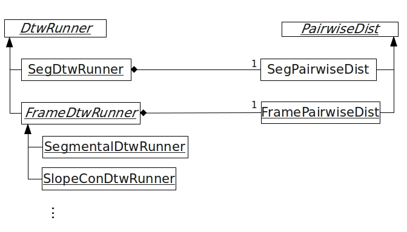

# libdtw - Dynamic time warping library

## General information
- This library contains DTW related code.
- Two files: **dtw_parm.h/cpp**  <-depend on-- **dtw_util.h/cpp**.
- Support **multi-threading** for **batch processing** (multiple queries searching for multiple documents):
  - Create N threads.
  - Dispatcher holds all (query, doc) pairs.
  - Each thread requests a (query, doc) pair in a while loop.

## dtw_parm.h/cpp
- ``class DtwParm`` Contains parameters to run DTW.

### functions (partial)
- ``DtwParm::LoadParm`` is overloaded with three prototype.
  - All three types can be used in frame-based DTW.
  - The 2nd type has additional basic segment infomation (but not supersegment informations)
  - Only 3rd type can be used in segment-based DTW.
  See [section 3.3](https://drive.google.com/file/d/1TqvicnaZABsRSHIh3PjJWVRic495qcEP/view?usp=sharing)

```cpp
namespace DtwUtil {
  class DtwParm {
    public:
      enum ParmType {FRAME = 0, SEGMENT = 1, SUPERSEG = 2};
      DtwParm();

      /* Load data */
      void LoadParm(const string feat_fname); // 1st type: Load feature only
      void LoadParm(const string feat_fname,  // 2nd type: Load feature and segment
                    const double bseg_ratio,
                    const string tree_fname = "");
      void LoadParm(const string feat_fname,  // 3rd type: Load feature,segment,supersegment
                    const double bseg_ratio,
                    const double superseg_ratio,
                    const unsigned width,
                    const unsigned gran,
                    const string tree_fname = "");

      void DumpData() const;
  };
} /* namespace DtwUtil */

```

## dtw_util.h/cpp


### Functions
- InitDtw(): setup input/output for DTW run
- DTW(): perform DTW on a query-document pair
- See test/example2.cpp for examples.

### Batch: multithreading
Assuming you have a query, and you want to search for hypothesized regions in all documents. The DTWs performed on different (query, document) pairs are disjoint. Therefore we divide them into smaller tasks, namely a (query, document) pairs. All threads can perform DTW on each task simultaneously.

#### DtwManager
```cpp
namespace DtwUtil {
  class DtwManager : public ThreadRunner {
    public:
      DtwManager();
      void Install(DtwBatchParamSet* paramset, DtwRunner* runner) {
      virtual void* Run() {
        while (paramset_->InstallDtwRunner(runner_)) runner_->DTW();
        return NULL;
      }
    private:
      DtwBatchParamSet* paramset_; // Make sure all DtwMangers share the same DtwBatchParamSet.
      DtwRunner* runner_; // Make sure all DtwManagers have *distinct* DtwRunners, otherwise it will fail.
  };
} /* namespace DtwUtil */
```
